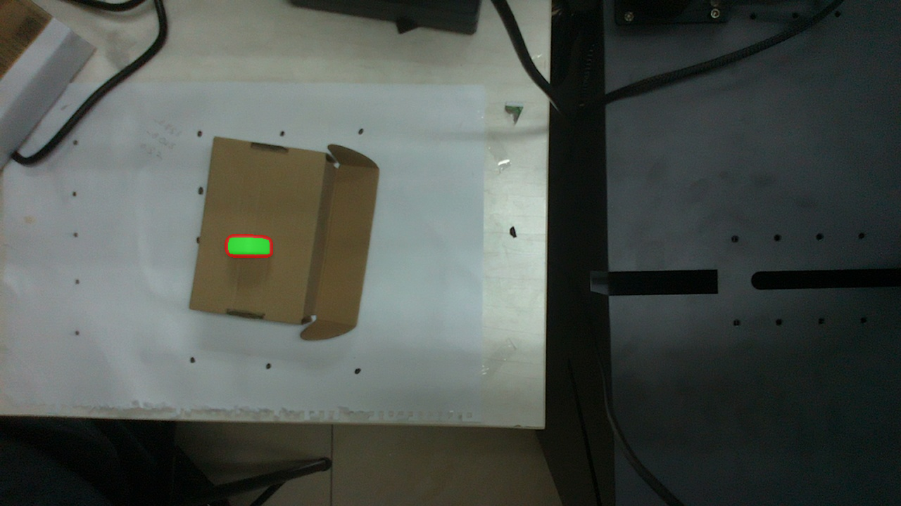
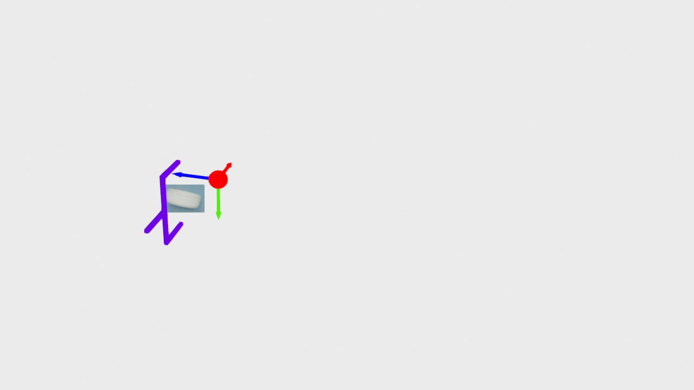
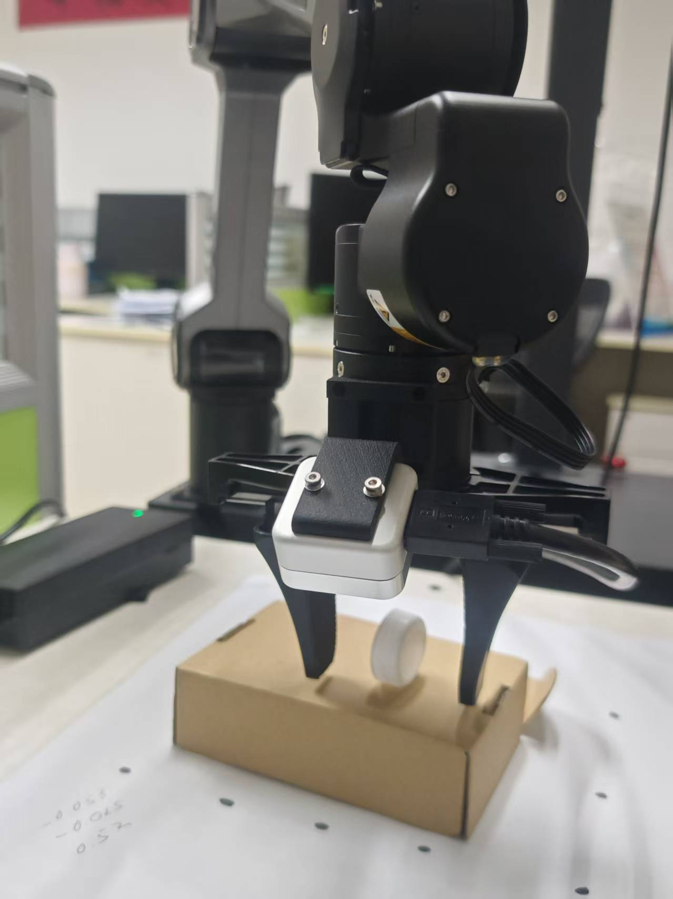

# 启动下位机

ssh common@10.5.23.176
cd /home/common/eye_hand
source /opt/ros/jazzy/setup.bash
source /home/common/brainarm-ws/install/setup.bash
python3 lower_server.py --host 0.0.0.0 --port 8888 \
  --color-topic /camera/color/image_raw \
  --depth-topic /camera/aligned_depth_to_color/image_raw \
  --info-topic /camera/color/camera_infos

# 启动上位机

cd /data1/gqma/Projects/Arm/zeroshot
python3 upper_client.py click eye_hand/R.txt eye_hand/t.txt

# VLM控制程序

### 模拟最小回环测试
python3 zeroshot_apps.py \
  --mode virtual \
  --rgb rgb.jpg \
  --depth depth.png \
  --pick_text "抓起桌面上最显眼的一个物体" \
  --place_text "把它放到桌面右下角的空白区域"

### 实机测试

python3 zeroshot_apps.py \
  --mode online \
  --host 10.5.23.176 \
  --port 8888 \
  --pick_text "抓起桌面上的瓶盖" \
  --place_text "把它放到桌面右下角的粉色盒子上"

  
  
  
  
  

# 坐标系约定

cam坐标系：
(x,y,z,rx,ry,rz)
左, 下，外，roll, pitch, yaw

左手坐标系